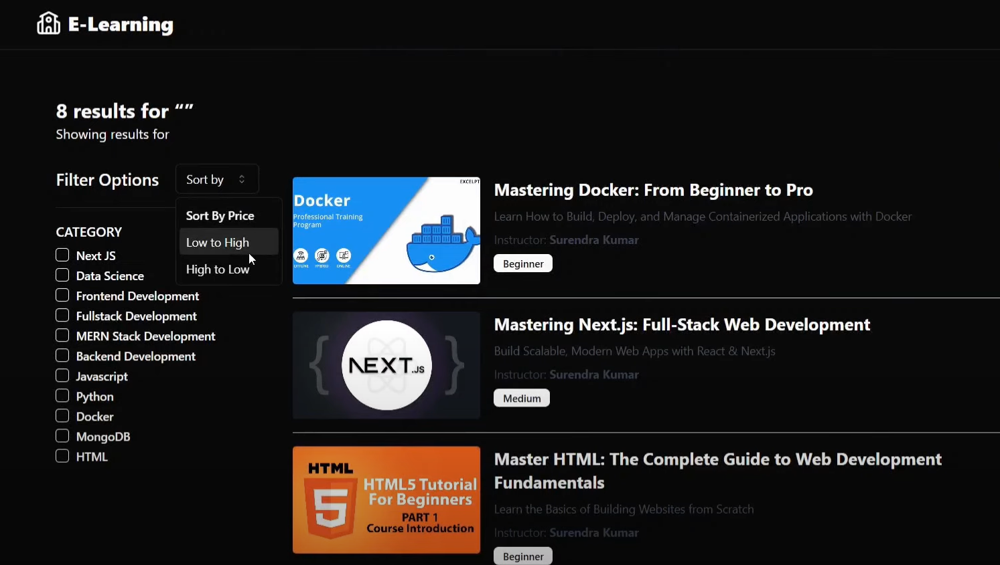
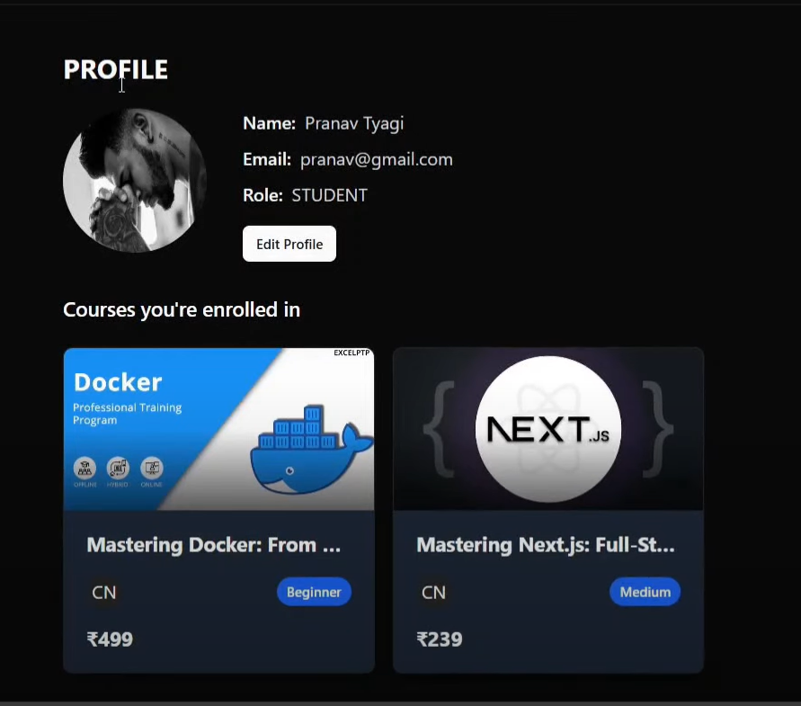
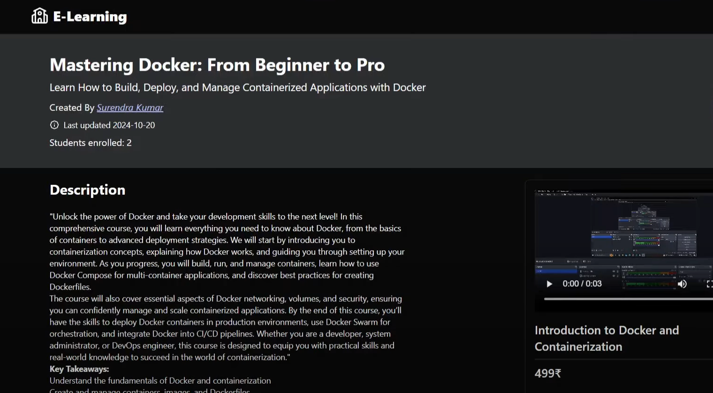
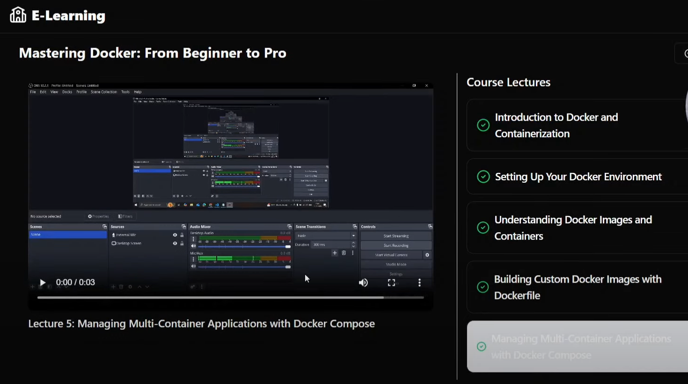

# LMS Prototype Development

## Overview
This repository contains the prototype for a Learning Management System (LMS) developed as part of the Eduvid Tutoring SDE Internship assignment. The prototype demonstrates fundamental features of an LMS, including user registration and login, course listing, progress tracking, role-based access, dark mode, Stripe payment gateway, and additional student interaction features. The entire project is built using the MERN stack.

## Features
1. **User Registration and Login**
   - Basic user authentication system.
   - Users can sign up and log in securely.
   - Role-based access to differentiate functionalities for students, instructors, and admins.

2. **Course Listing Page**
   - Displays a list of mock courses.
   - Each course includes a title, description, and an "Enroll" button.

3. **Progress Tracking**
   - Simulates progress tracking for a single course (e.g., "50% completed").
   - Students can mark individual classes as complete.

4. **Dark Mode**
   - Includes a toggle to enable/disable dark mode for enhanced user experience.

5. **Stripe Payment Gateway**
   - Integrated Stripe for secure payment processing.
   - Students can purchase courses and access paid content.


## Screenshots

### Homepage


### Category And Sort prices Page


### Profile Page


### Couse details page


### Video Class Page



## Tech Stack
- **Backend**: Node.js with Express.js.
- **Frontend**: React.js.
- **Database**: MongoDB (to store user data, progress, and transactions).

## Getting Started
### Prerequisites
- Ensure you have the following installed on your system:
  - **Node.js** (v16 or later).
  - **npm/yarn** (for managing dependencies).
  - **MongoDB** (local or cloud-based).

### Installation
1. Clone the repository:
   ```bash
   git clone https://github.com/uday778/EDUVID_LMS_Task
   cd EDUVID_LMS_Task
   ```

2. Set up environment variables:
   - Create a `.env` file in the root directory.
   - Add required configuration in server directory:
     ```
     MONGO_URI=<your-mongodb-connection-string>
     STRIPE_SECRET_KEY=<your-stripe-secret-key>
     STRIPE_PUBLIC_KEY=<your-stripe-public-key>
     SECRET_KEY=<your-jwt-secret>
     API_KEY=<Cloudinary Api Key>
     API_SECRET=<Cloudinary api secrete>
     CLOUD_NAME=<CLOUD_NAME>
     PORT=<PORT>
     ```

### Running the Project
- **Backend**:
  ```bash
  npm install
  npm run dev
  ```

- **Frontend**:
  ```bash
  npm install
  npm run dev
  ```
  
## Submission Details
- Hosted Repository: https://github.com/uday778/EDUVID_LMS_Task
- Submission Link: ....

---
For any queries, feel free to contact Uday33379@gmail.com.
